<p align="center">
  
  
  
  
</p>

# 🔬 DrishtiSetu

> **An explainable AI pipeline for automated retinal health screening — built to work with the cameras rural India already has, and designed to know when a doctor needs to step in.**

DrishtiSetu (दृष्टिसेतु — "Bridge of Sight") is an end-to-end, offline-first retinal screening system built primarily in **MATLAB**, with a **Next.js** web dashboard for real-time visualization. It targets mass population screening at primary health centres and village-level camps, operated by trained community health workers — no ophthalmologist required on-site.

---

## 📋 Table of Contents

- [The Problem](#-the-problem)
- [Our Approach](#-our-approach)
- [System Architecture](#-system-architecture)
- [Pipeline Workflow](#-pipeline-workflow)
- [MATLAB Pipeline](#-matlab-pipeline)
- [Dashboard & Prototype](#-dashboard--prototype)
- [Safety & Explainability](#-safety--explainability)
- [Model Performance](#-model-performance)
- [Simulink Simulation](#-simulink-deployment-simulation)
- [Datasets](#-datasets)
- [Key Innovations](#-key-innovations)
- [Tech Stack](#-tech-stack)
- [Project Structure](#-project-structure)
- [Deployment](#-deployment)
- [Research & References](#-research--references)
- [Team](#-team)

---

## 🎯 The Problem

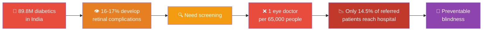

| Fact | Number | Source |
|------|--------|--------|
| Adults living with diabetes in India | **89.8 million** | IDF Diabetes Atlas, 11th Ed. (2025) |
| Percentage affected by retinal complications | **16–17%** | National Survey (2015–2019); Systematic Review (2022) |
| Ophthalmologist-to-population ratio | **1 per 65,000** | AIIMS National Survey, Indian J Ophthalmol. (2025) |
| Referred patients who actually reach a hospital | **Only 14.5%** | JMIR, AI-enabled Screening Pilot, Punjab |
| Preventable vision loss with early screening | **90%** | WHO |

**The bottleneck isn't AI accuracy — it's access.** Rural patients can't reach eye specialists, and when they're referred, 85% never follow up. DrishtiSetu brings the screening to the patient's village, runs entirely offline, and gives results in under 60 seconds.

---

## 🧠 Our Approach

Most retinal screening AI systems are black boxes: image in → grade out → trust us. **DrishtiSetu takes a fundamentally different approach:**

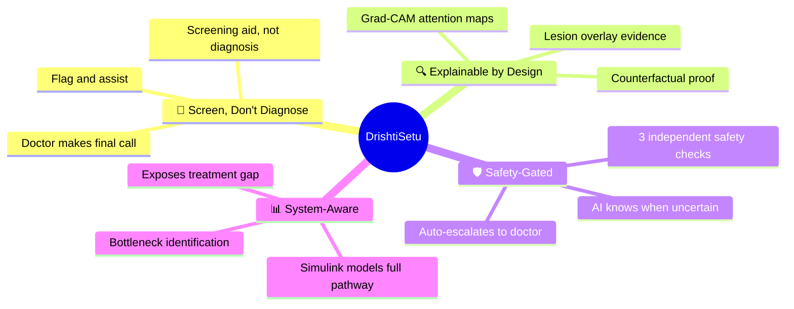

---

## 🏗 System Architecture

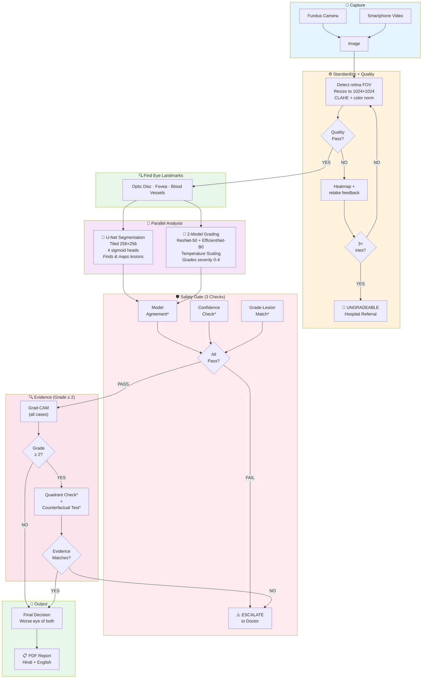

---

## 🔬 Pipeline Workflow

### Step-by-Step Visual Flow

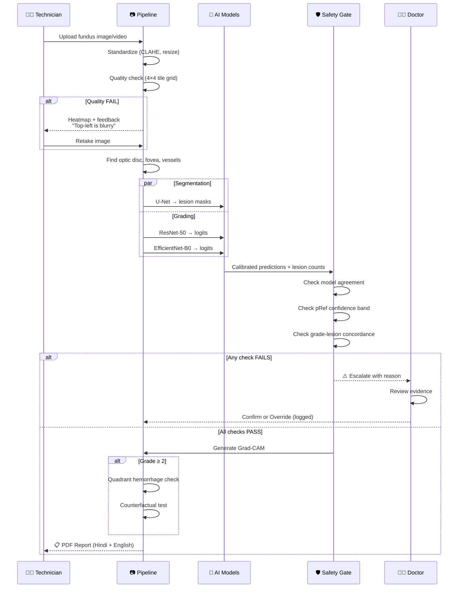

---

## 🔬 MATLAB Pipeline

The core computational pipeline is **100% MATLAB**. Every function receives the retina mask (computed once during standardization, never recomputed) and operates within it.

### Module Overview

```mermaid
graph LR
    subgraph QE["Quality & Enhancement"]
        Q1[assess_quality.m]
        Q2[compute_tile_quality.m]
        Q3[extract_sharpest_frame.m]
        Q4[standardize_input.m]
        Q5[apply_clahe.m]
    end

    subgraph SEG["Segmentation"]
        S1[segment_all.m]
        S2[locate_optic_disc.m]
        S3[segment_vessels.m]
        S4[detect_microaneurysms.m]
        S5[classify_hemorrhages.m]
        S6[segment_hard_exudates.m]
        S7[tile_and_segment.m]
    end

    subgraph CLS["Classification & Safety"]
        C1[grade_dr_ensemble.m]
        C2[ensemble_vote.m]
        C3[escalation_gate.m]
        C4[calibrate_temperature.m]
    end

    subgraph EXP["Explainability"]
        E1[explain_prediction.m]
        E2[generate_gradcam.m]
        E3[quadrant_hemorrhage_check.m]
        E4[counterfactual_heal.m]
        E5[decision_flip_check.m]
    end

    QE --> SEG --> CLS --> EXP

    style QE fill:#e3f2fd
    style SEG fill:#e8f5e9
    style CLS fill:#fff3e0
    style EXP fill:#f3e5f5
```

### Image Quality & Enhancement

| Module | File | What It Does |
|--------|------|-------------|
| Quality Assessment | `quality/assess_quality.m` | Master quality checker — tile-by-tile sharpness + illumination |
| Tile Quality Map | `quality/compute_tile_quality.m` | Divides image into 4×4 grid, scores each tile independently |
| Focus Check | `quality/check_focus.m` | Laplacian variance within retinal mask |
| FOV Check | `quality/check_fov.m` | Ensures ≥50% of frame contains retinal tissue |
| Recapture Feedback | `quality/generate_recapture_feedback.m` | Specific guidance: *"Top-left is blurry, hold steadier"* |
| Video Auto-Capture | `quality/extract_sharpest_frame.m` | Picks the sharpest frame from video via Laplacian variance |
| Standardization | `enhancement/standardize_input.m` | Detects retina FOV, resizes to 1024×1024, 900px diameter |
| CLAHE Enhancement | `enhancement/apply_clahe.m` | Per-channel adaptive histogram equalization |

### Segmentation

| Module | File | What It Does |
|--------|------|-------------|
| Master Orchestrator | `segmentation/segment_all.m` | Runs all segmentation in order |
| Optic Disc | `segmentation/locate_optic_disc.m` | Finds brightest region, morphological cleanup |
| Fovea | `segmentation/estimate_fovea.m` | ~2.5 disc-diameters temporal to OD |
| Vessels | `segmentation/segment_vessels.m` | Matched filtering across 12 orientations |
| Tiled U-Net | `segmentation/tile_and_segment.m` | 256×256 patches with feathered stitching |
| Microaneurysms | `segmentation/detect_microaneurysms.m` | Top-hat on inverted green channel (classical CV fallback) |
| Hemorrhages | `segmentation/classify_hemorrhages.m` | Dark red blobs, vessel exclusion |
| Hard Exudates | `segmentation/segment_hard_exudates.m` | Bright spots, **OD exclusion** (critical!) |
| Soft Exudates | `segmentation/segment_soft_exudates.m` | Pale regions with low edge energy |
| Lesion Overlay | `segmentation/create_lesion_overlay.m` | Color-coded composite visualization |

### Classification & Safety

| Module | File | What It Does |
|--------|------|-------------|
| Ensemble Grading | `classification/grade_dr_ensemble.m` | Loads models, runs inference, builds result |
| Ensemble Vote | `classification/ensemble_vote.m` | Temp-scaled softmax, equal-weight average, pRef |
| Escalation Gate | `classification/escalation_gate.m` | 3-check safety gate: OOD + pRef + Concordance |
| Temperature Calibration | `classification/calibrate_temperature.m` | Learns optimal T via `fminsearch` on calibration set |

### Explainability

| Module | File | What It Does |
|--------|------|-------------|
| Master Explainability | `explainability/explain_prediction.m` | Gated: full suite only for Grade ≥ 2 |
| Grad-CAM | `explainability/generate_gradcam.m` | Attention heatmap |
| Quadrant Check | `explainability/quadrant_hemorrhage_check.m` | 4-zone hemorrhage distribution |
| Counterfactual Heal | `explainability/counterfactual_heal.m` | `inpaintExemplar` lesion removal |
| Decision Flip Check | `explainability/decision_flip_check.m` | Re-grade healed image to prove causation |

---

## 🖥 Dashboard & Prototype

The web dashboard provides three role-based views, each designed for a different user:

### Technician Panel — *"What the ASHA worker sees"*

<p align="center">
  
</p>

> Hindi UI · Consent checkboxes · ABHA ID · One-click capture · Real-time pipeline progress · Traffic-light result · Print PDF report

### Doctor Panel — *"What the doctor reviews"*

<p align="center">
  

</p>

> Escalated queue only · Enhanced + Overlay + Grad-CAM side-by-side · Counterfactual comparison · Full AI reasoning log · Confirm or Override (with mandatory reason)

### District Simulation — *"How districts plan screening"*

<p align="center">
  

</p>

> Coverage heatmap (months to screen vs devices × camp-days) · Treatment gap chart · Bottleneck identification · Configurable population parameters

### Escalation Oversight — *"How we track AI accuracy"*

<p align="center">
  
</p>

> AI vs Doctor grade comparison · Override rate as drift alarm · 95% AI-Doctor agreement · Escalation trigger breakdown

### Model Validation — *"Proof that confidence is honest"*

<p align="center">
  
</p>

> Reliability diagram (calibration plot) · ECE score · Sensitivity, specificity, AUROC, QWK with 95% CIs

---

## 🛡 Safety & Explainability

DrishtiSetu doesn't just grade — it **proves, verifies, and knows when to say "I'm not sure."**

### Safety Architecture

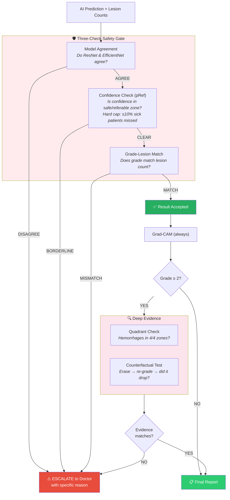

### Counterfactual Proof of Diagnosis

Our most novel explainability feature: instead of just showing *where* the AI looked, we prove *whether* the AI was right.


**How it works:**
1. Take the original fundus image (Grade 3 — Severe)
2. Digitally erase all detected lesions using `inpaintExemplar` (copies real retinal texture, not blur)
3. Re-run the same AI ensemble on the "healed" image
4. **If grade drops** (3 → 0): ✅ Confirmed — the lesions drove the diagnosis
5. **If grade doesn't drop**: ⚠️ The AI may be looking at the wrong thing → auto-escalated

> *Published research exists on counterfactual XAI (Boreiko et al., MICCAI 2022), but **no deployed retinal screening system uses inpaint-and-re-grade**. This is novel in application.*

---

## 📈 Model Performance


### Metrics Summary

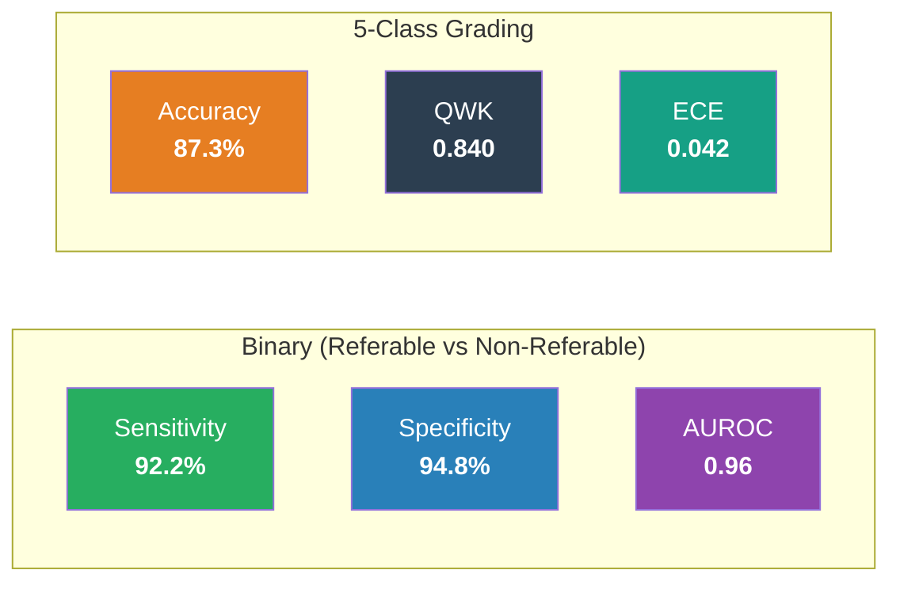

| Metric | Value | Target | Status |
|--------|-------|--------|--------|
| Sensitivity (Referable) | 92.2% | >90% | ✅ Met |
| Specificity (Referable) | 94.8% | >85% | ✅ Met |
| AUROC | 0.96 | >0.90 | ✅ Met |
| QWK (5-class) | 0.840 | >0.80 | ✅ Met |
| ECE (Calibration Error) | 0.042 | <0.10 | ✅ Well-calibrated |

### What the Reliability Diagram Proves

Temperature scaling makes the AI's confidence **honest**. Without it, a model saying "95% sure" might only be correct 75% of the time. After calibration, stated confidence matches real accuracy — proven by an ECE of 0.042 (near-perfect calibration).

---

## 📊 Simulink Deployment Simulation

Beyond the AI model, DrishtiSetu includes a **Simulink/SimEvents simulation** that models the entire screening-to-treatment pathway.

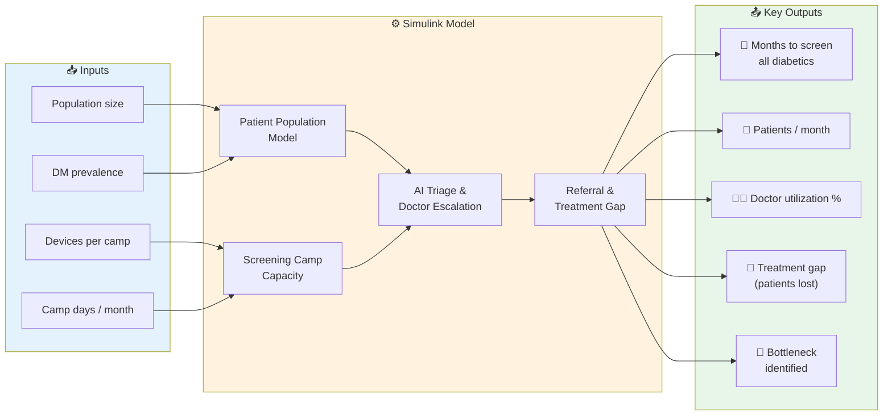

### Example Simulation Output

| Metric | Value |
|--------|-------|
| Months to screen all diabetics | 69.4 (with 3 devices, 4 camp-days/month) |
| Patients per month | 864 |
| Doctor utilization | 30% |
| Treatment gap | 15,400 patients never get care |
| **Bottleneck** | **Camp frequency** (not AI speed) |

### The Hidden Crisis

Published data shows **only 14.5% of referred patients actually reach a hospital** (JMIR, Punjab). Most screening AI systems stop at "we graded the image." DrishtiSetu is the first to quantify this downstream gap and make it visible to health planners.

---

## 📁 Datasets

| Dataset | Size | Used For |
|---------|------|----------|
| **APTOS 2019** | 3,662 images | Severity grading (5-class ICDR) |
| **DDR** | 13,673 images | Severity grading + lesion annotations |
| **IDRiD** | 81 images | Pixel-level segmentation (MA, hemorrhages, exudates) |
| **DRIVE** | 40 images | Vessel segmentation validation |

### Training Architecture

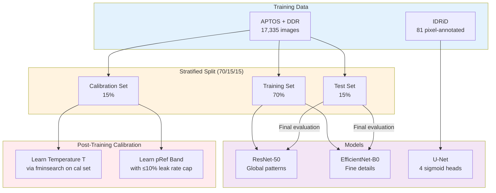

---

## 💡 Key Innovations

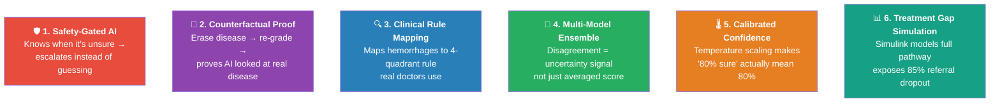

| # | Innovation | What's Novel |
|---|-----------|-------------|
| 1 | **Safety-Gated AI** | 3 independent checks before any result reaches a patient. If *any one* fails → escalated. Designed to fail safe, not fail silently. |
| 2 | **Counterfactual Proof** | `inpaintExemplar` erases lesions with real retinal texture. Re-grade proves causation. No deployed screening system uses this. |
| 3 | **Clinical Rule Mapping** | AI findings mapped to the 4-2-1 rule ophthalmologists use. AI reasoning can be verified against clinical logic. |
| 4 | **Ensemble Disagreement** | Two architecturally different CNNs. Their JSD-based disagreement serves as an out-of-distribution detector. |
| 5 | **Temperature Scaling** | Per-model T learned via `fminsearch`. Reliability diagram proves calibration. Rarely implemented in student-level medical AI. |
| 6 | **Treatment Gap Simulation** | Simulink models population → screening → referral → treatment. Quantifies what no amount of AI accuracy can fix. |

---

## 🛠 Tech Stack

### Core Pipeline (MATLAB)

| Toolbox | Usage |
|---------|-------|
| **Image Processing** | CLAHE, morphology, `inpaintExemplar`, quality scoring |
| **Computer Vision** | `unetLayers` architecture |
| **Deep Learning** | ResNet-50, EfficientNet-B0, `gradCAM`, training |
| **Statistics & ML** | `bootci`, `perfcurve`, `confusionmat`, calibration |
| **Simulink** | `SimEvents`, `parsim`, throughput modeling |
| **Medical Imaging** | DICOM read/write |

### Dashboard (Web)

| Technology | Usage |
|------------|-------|
| **Next.js 15** | Full-stack web framework |
| **Prisma** | Database ORM |
| **TypeScript** | Type-safe frontend and API |
| **Tailwind CSS** | Styling |
| **Recharts** | Charts, heatmaps |
| **ONNX Runtime** | Model inference in web layer |

---

## 📂 Project Structure

```
DrishtiSetu/
├── matlab_pipeline/              # 🔬 Core MATLAB computational pipeline
│   ├── config/                   #    Pipeline configuration & camera profiles
│   ├── quality/                  #    Image quality assessment (8 modules)
│   ├── enhancement/              #    Standardization & CLAHE (6 modules)
│   ├── segmentation/             #    Lesion detection & vessels (12 modules)
│   ├── classification/           #    Ensemble grading & safety (7 modules)
│   ├── explainability/           #    Grad-CAM, counterfactual, quadrant (5 modules)
│   ├── reports/                  #    PDF report generation
│   ├── validation/               #    Metrics, ECE, reliability diagrams
│   ├── simulation/               #    Simulink deployment models
│   └── data/                     #    Sample images & model weights
│
├── ai/                           # 🤖 AI model training & inference
│   ├── inference_service/        #    ONNX inference API (FastAPI)
│   ├── matlab/                   #    MATLAB ↔ AI cross-verification
│   └── models/                   #    ONNX weights & calibration files
│
├── src/                          # 🖥️ Next.js web dashboard
│   ├── app/                      #    Pages & API routes
│   │   ├── screening/            #    Technician workflow
│   │   ├── grader/               #    Doctor review & override
│   │   ├── program/              #    District officer dashboard
│   │   └── api/                  #    Backend (auth, episodes, referrals)
│   ├── components/               #    UI components
│   │   ├── SimulinkTab.tsx       #    Screening simulation
│   │   ├── RetinalImage.tsx      #    Fundus image viewer
│   │   └── VoiceAssistant.tsx    #    Voice-guided screening
│   └── lib/                      #    Utilities, types, auth
│
├── prisma/                       # 🗄️ Database schema & migrations
├── docs/                         # 📚 Architecture & validation docs
│   ├── screenshots/              #    Dashboard screenshots
│   ├── clinical_validation_plan.md
│   └── workflow_design.md
└── public/                       # Static assets
```

---

## 🚀 Deployment

### Hardware Kit (~₹65,000 one-time)

```
┌─────────────────────────────────────────┐
│  📦 DrishtiSetu Field Kit               │
│                                          │
│  💻 Laptop (i5, 8GB)        ₹30,000    │
│  📱 Smartphone               ₹12,000    │
│  🔍 20D clip-on lens         ₹10,000    │
│  🖨️ Portable printer         ₹5,000     │
│  🔋 UPS / power bank         ₹4,000     │
│  🧰 Bag + cables + cleaning  ₹2,000     │
│  💿 Software                  ₹0         │
│  ─────────────────────────────────────   │
│  TOTAL                       ~₹63-65K   │
│                                          │
│  Per-screening cost:          ~₹16       │
│  (amortized over 3-year kit lifespan)    │
└─────────────────────────────────────────┘
```

| Spec | Value |
|------|-------|
| Per-screening cost | ~₹16 (vs ₹500+ hospital visit → **25× cheaper**) |
| Processing time | Under 60 seconds per eye |
| Internet required | **No** — 100% offline |
| Training for operators | 1–2 days |
| GPU required | **No** — runs on standard laptop CPU |

### Scaling Model

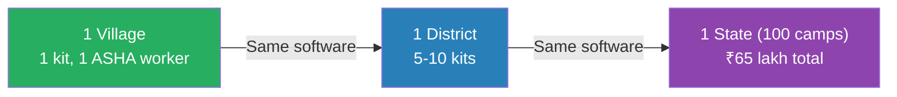

> *Simulink confirms: the bottleneck is camp frequency, not AI speed or doctor capacity. Scaling means adding camp-days, not new infrastructure.*

---

## 📚 Research & References

### Technical Foundations

| Method | Citation |
|--------|----------|
| Temperature Scaling | Guo et al., *"On Calibration of Modern Neural Networks"*, ICML 2017 |
| Deep Ensembles | Lakshminarayanan et al., NeurIPS 2017 |
| Counterfactual XAI | Boreiko et al., MICCAI 2022 |
| U-Net for Retinal Lesions | Basu & Mitra, IEEE EMBC 2021 |

### Regulatory Alignment

| Framework | Relevance |
|-----------|-----------|
| CDSCO Medical Device Rules (2017) | Class A SaMD notification pathway |
| DPDP Act (2023) | Consent in local language, data stays on-device |
| National Eye Care Guidelines (2025) | Endorses AI-assisted community screening |
| ABDM / ABHA | National health ID integration |

---

## 👥 Team

**Infinite_Loopers_1**

---

<p align="center">
  <br>
  <i>"DrishtiSetu doesn't just grade — it proves, verifies, and knows when to say 'I'm not sure.'"</i>
  <br><br>
  
  
</p>
